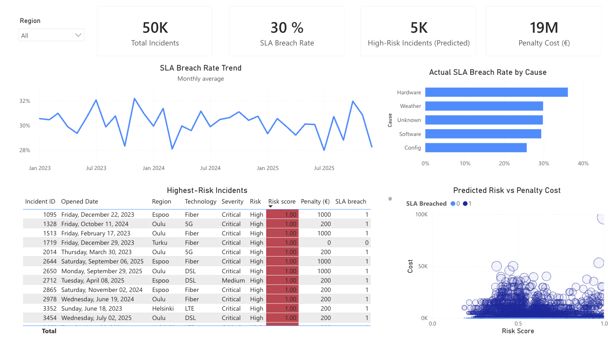
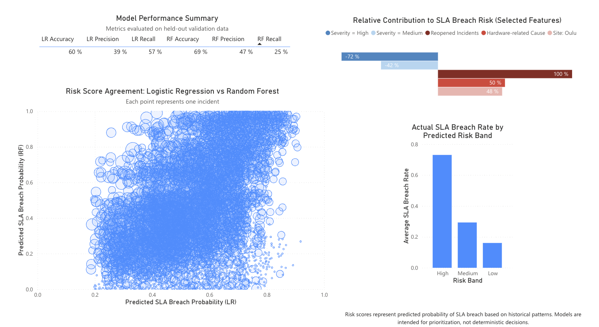

# Telecom SLA Risk Predictor
Overview
This is basically a full operational triage system I built to try and predict network failures before they actually happen. The main idea is to help support teams prioritize tickets so they don't miss the SLA deadlines which costs a lot of money in penalties.

I built the whole thing using Python for the data and modeling part, and then Power BI for the dashboard. It’s mostly simulating a telecom environment (like Nokia) where you have different technologies like 5G and Fiber.

## The Data Simulation
Since I couldn't really get actual sensitive telecom data, I wrote a script called `data_gen.py` to generate a synthetic dataset. It makes about 50,000 rows of incident data. By changing the parameters, the number can be increased or decreased to any desired number. 

It’s not just random noise though. I added some specific logic to make it realistic:

- Regional stuff: I made it so Oulu and Turku have higher failure rates in the winter to simulate weather issues (sorry Oulu!).

- Tech issues: 5G has more variance in resolution times since it's newer.

- Logic: I used numpy to weight the probabilities so it wasn't just a uniform distribution.

## Machine Learning Models
I trained two different models in scikit-learn to get the risk scores.

- **Logistic Regressio**n: I used this mostly to see which features were actually driving the failures (like severity or previous reopen counts).

- **Random Forest**: This was better for accuracy since the data isn't perfectly linear.

For the final output, I just took the maximum probability from both models to be safe. That way we don't miss high risk tickets if one model misses it.

## The Dashboard
The dashboard is built in Power BI and connects to the CSV output from the Python script. There are two main pages 

### Operational Triage (Page 1) 
This is for the managers or engineers. It shows the money at risk and has a table sorted by the risk score so they know what to fix first.

### Model Analysis (Page 2) 
This is more for validating that the models actually work. It compares the two models against each other to see where they disagree. It also lists the feature importance.

## Files in this repo
`data_gen.py`: The script that generates the CSV and trains the models.

`sla_risk_powerbi.pbix`: The Power BI file.

`datasets/`: The folder where the CSV saves.

## How to run it
Run the python script first to generate the data. It takes a second to run.

'python data_gen.py'
Open the .pbix file. You might need to change the data source setting to point to your local `datasets/dashboard_data.csv` file if the path is different.